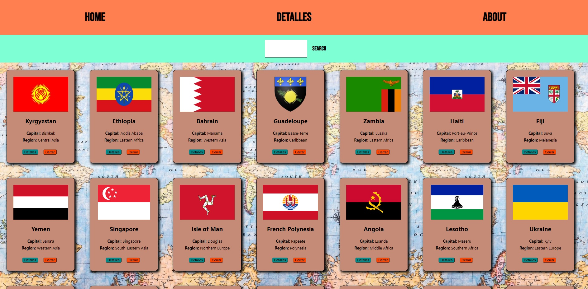

# FLAGS OF THE WORLD APP

  

## Objetivos del Proyecto

- Construir una App utlizando React, Hooks, JSX, CSS, otros.
- Aprender mejores prácticas.
- Aprender y practicar el workflow de GIT.
- Usar y practicar testing.

## Enunciado

La idea general es crear una aplicación en la cual se puedan ver todos los paises disponibles junto con información relevante de los mismos utilizando la api externa https://restcountries.com/v3/all y a partir de ella poder, entre otras cosas:

  - Busqueda por país.
  - Filtrarlos / Ordenarlos
  - Agregar nuevos videojuegos
  - Ver detalle individual

#### Tecnologías necesarias:

- [ ] React
- [ ] HTML
- [ ] CSS
